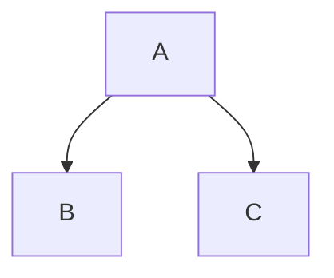

# WatzThisWithGoogleMap!
## subHeading Level 2
### subsubHeading Level 3

Another _version_ using the equal sign for Level 1
====

And the - sign for **Level 2** -single or many gives the same results
-

___

~~May not work for others, but OK for markdown~~
 
 Added `location using Google `to WatzThis

 ***

> This should be quoted 

		**bold**
		__bold__
		
		*italic*
		_italic_
		
		~~strike through~~
		
		Ø Quotation 
	
		--- Horizontal Rule
		*** Asterisks 
___ Underscore 

https://wwwlinkedin.com 


 [website](https://www.linkedin.com "LinkedIn")
 
	
 [LinkedIn]
	
 [learning][1]
	
 [Linkedin]: https://www.linkedin.com
 
 [1]:https://www.linkedin.com/learning

www.linkedin.com


Images


![Tomolor]
[Tomolor]:https://pixelprowess.com/i/stargazers/tomolor.png
[](https://raybo.org)


```js

let x = 5;
console.log(x);
```


  This is a footnote[^1]. Another footnote[^2].

  [^1]: My reference 
  [^2]: Another footnote

  


| Left | Center | Right |
| ----- | :----: | ------: |
| One | Two | $1.00 |
| Three | Four | $120.00 |
| Five | Six | $0.99 |


/


- [x] First
  - [x] One
  - [ ] Two
- [ ] Second


<details>
 <summary>collapsed</summary>

# Header

This is the copy for the collapsed text.
</details>


	Drag/Drop/Paste
	
	These types of files:
	
		.png
		.gif
		.jpg
		.jpeg
		.svg
		.log
		.docx
		.pptx
		.xlsx
		.txt
		.pdf
		.zip
		.gz
		.tgz
		.mp4
		.mpv
		.webm
		
	Normally a size limit of 50MBytes


Type a : and start typing the name of an emoji and selections show up to chose from.
✈️
💤

	Mermaid Graphs 


 mermaid and others 
 


End of the lists of Additions at this time


